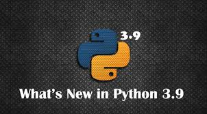
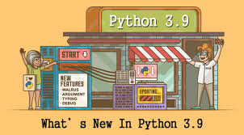
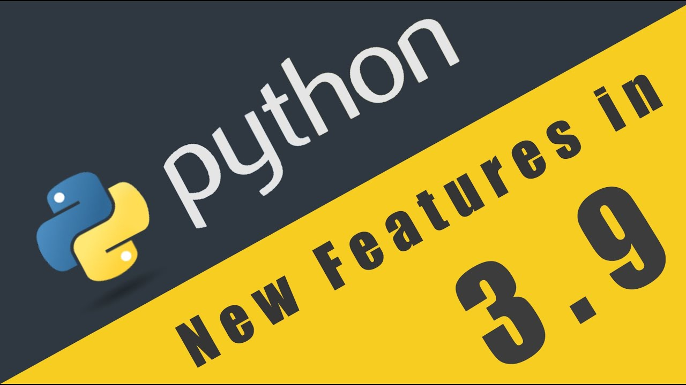

# Python 3.9: What’s new and better

+ Major Python update brings a faster release schedule, performance boosts, handy new string functions,
 dictionary union operators, and more consistent and stable internal APIs.
     
      + More Python string and dictionary functions
      
      + Decorators lose some restrictions
      
      + New Python type operations
      
      
      + Improvements to Python internals
      
      + Other changes in Python 3.9
      
      
      
      + Type Hinting Generics in Standard Collections
      
      + New Modules
          
           + zoneinfo
           
      + CPython bytecode changes
      
      + C API Changes
      
      
# Features That You Should Know

+ Dictionary updates
   + Dictionaries are one of the most useful and used data structures in Python. The new release has optimized the way of merging and updating dictionaries.

+ Type Hinting
     
     + Under normal conditions, we don’t specify the datatype in Python. But there can be situations where we might need a variable to behave in a certain type. In such cases,          Python’s flexibility can be annoying. Starting with Python 3.5, we could specify types but this update has made things way too easier.
 
+ String Methods

   + Two new features have been added to the str object. This feature can sometimes come in handy in the Exploratory Data Analysis process.
   
   
 + Math functions
     
      + A modification to an existing math function has been made. In earlier versions, the function to calculate GCD accepts only two numbers. But now, it can be applied to any         number of values.
      
  
 
 
 
  
 
 
 
  
  
  
  
  
  

   
